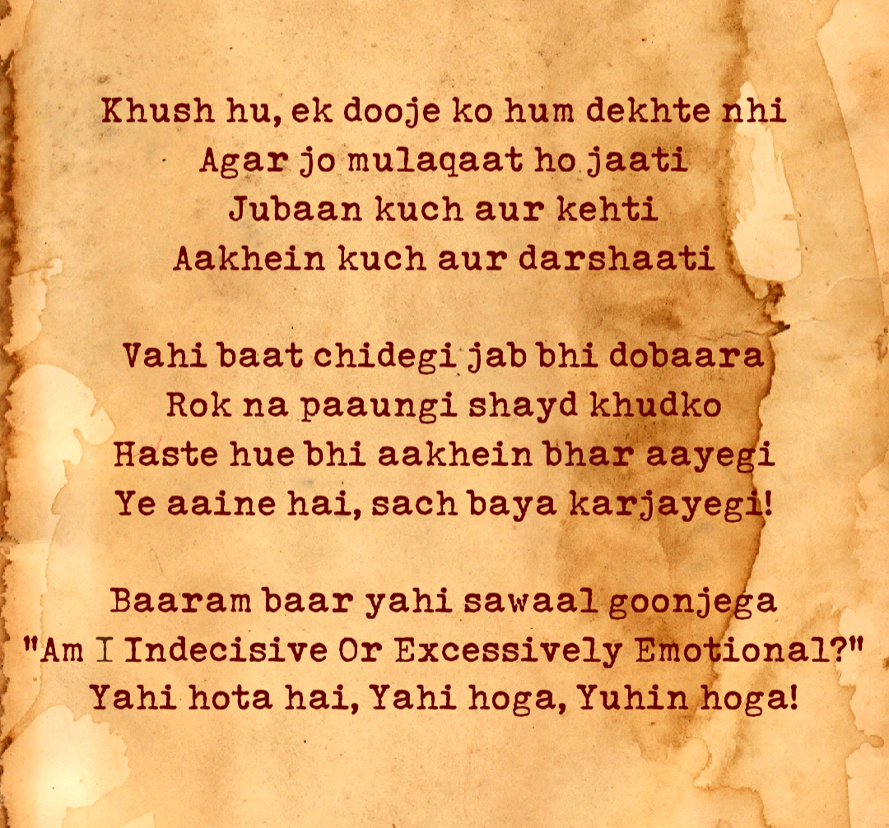

This poem, written after a difficult experience explores self-awareness, emotional vulnerability, and the acceptance of imperfections. It quietly touches on the internal conflict of emotions and the inevitability of self-doubt.
 
