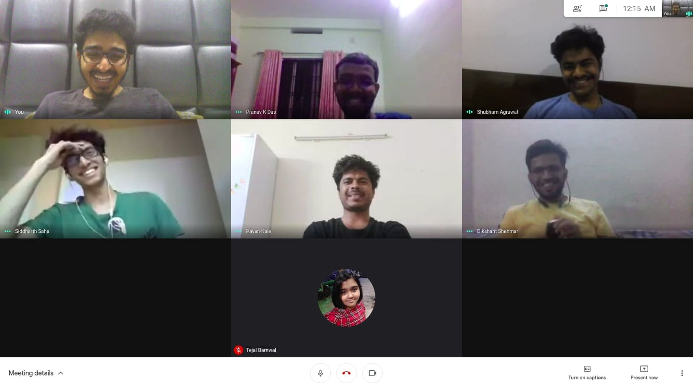

# Vision Based Obstacle Avoidance Drone

This compeititon was a part of **Inter IIT Technical Meet '21** where we had to simulate quadrotor capable of navigating in a complex static environment by avoiding on-field obstacle-collision and reaching the target destination after its correct detection.

<iframe width="600" height="512"
src="https://www.youtube.com/watch?v=PdL64qHd97I&t=6930s">
</iframe>

For this purpose we came up with a three-layered navigation pipeline- Greedy Expploration, Scan and Survey and Sense of Progree vectors.
For the first layer of decision making,
Scan and Survey pipeline consisted of
Though we could not implement it completely, the sense of progress vector pipeline intended at
The drone was simulated inside ROS/Gazebo using Ardupilot SITL.

The details of the implementation could be found <a href="https://drive.google.com/file/d/1S8aawsni-Yod5IolbUaHhbD5gRYDpB4e/view?usp=sharing">here</a>.

<a href="https://drive.google.com/file/d/1S8aawsni-Yod5IolbUaHhbD5gRYDpB4e/view?usp=sharing">Here</a> is the link to the code repository.

Due to Covid, the technical meet was held in online mode and team consisting of 8 members worked on it from their own homes. A glimpse of the same could be found in the picture attached.

<!--  -->

