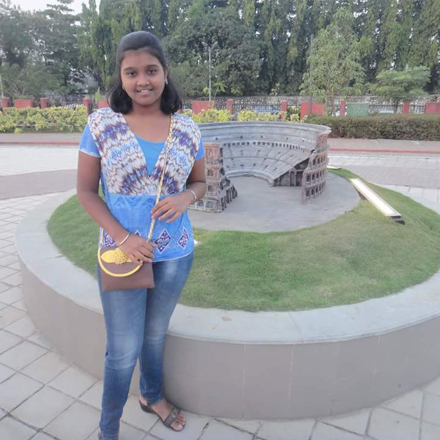

<!-- # **About Me** -->
<h1 style="text-align: center;"><b>About Me</b></h1>
 

  

  
  

  
Hello there  :wave: I am <b>Tejal</b>,

    

    I'm a junior undergraduate at the <a href="https://www.iitb.ac.in/">Indian Institute of Technology, Bombay</a>majoring in <a href="https://www.me.iitb.ac.in/">Mechanical Engineering</a> and pursuing a minor degree in the <a href="https://www.cse.iitb.ac.in/">Department of Systems and Control Engineering</a>.  

<!-- 






 -->
